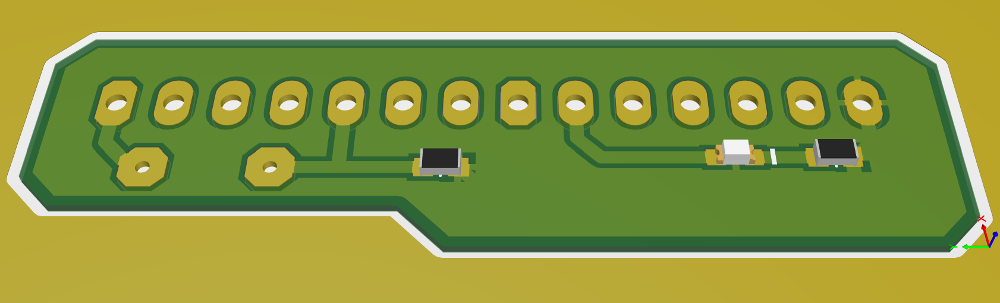
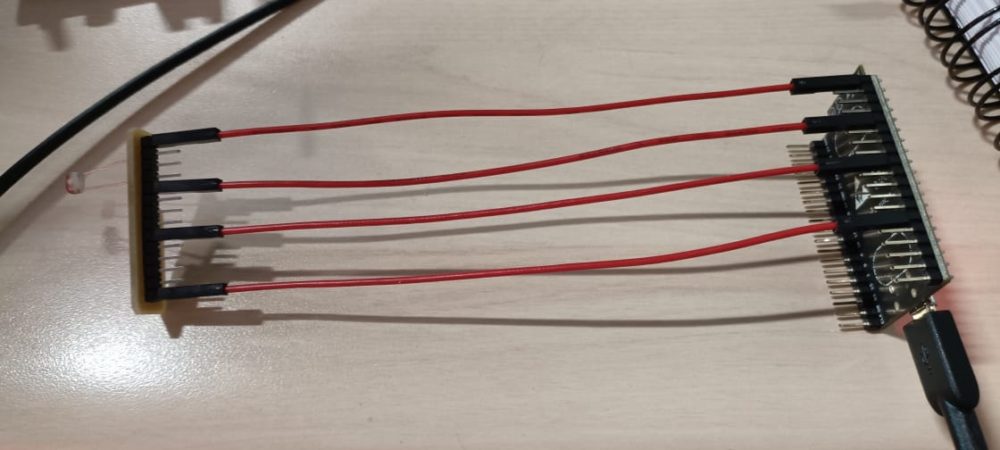
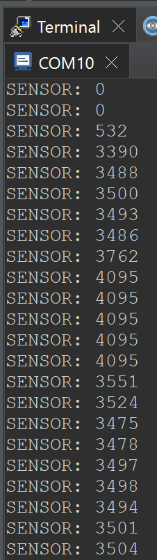

Práctica 02 - MSE Curso: Sistemas Embebidos Distribuidos
====================

Alumno: Carlos Herrera Trujillo

Actividad 1: Lectura del sensor
-------------------------------

Actividad de montaje de LDR y verificación de lecturas.

1. Tarjeta de conexión con GPIO34 para la lectura del LDR (en serie con resistencia de 10K) y 
GPIO25 para la emisión PWM en Led Rojo.
 

	
	

2. Configuración y uso del ADC, se utiliza el GPIO34 (ADC1_6) en el cual se hace una lectura 
periodica de 250ms (4 Hz) y, así mismo, se imprime a traves del monitor serial el valor obtenido.

	

