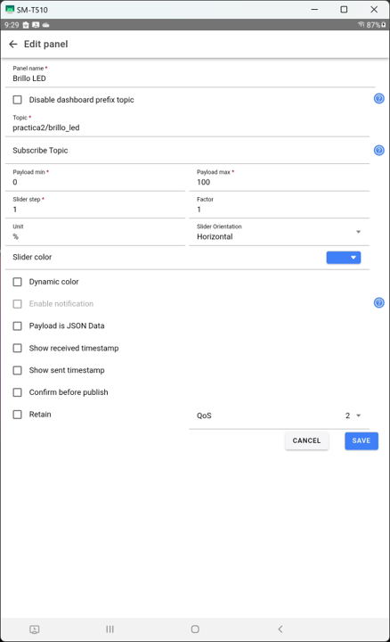
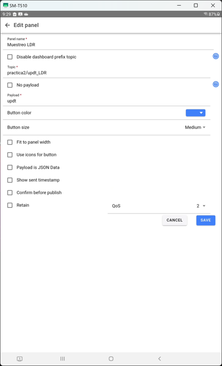
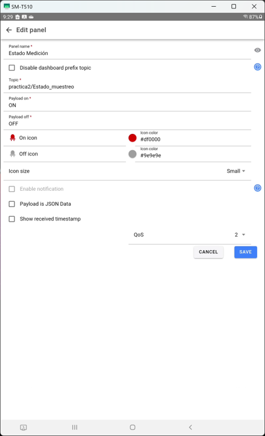
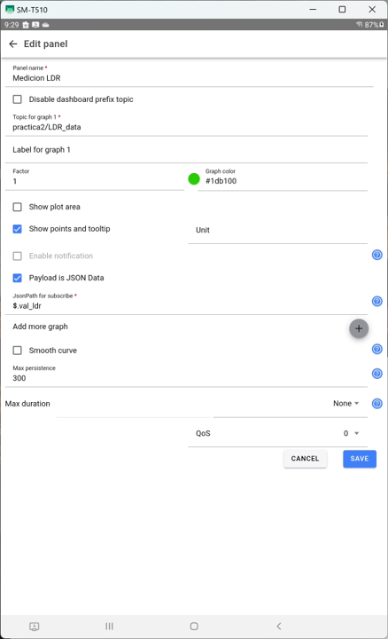
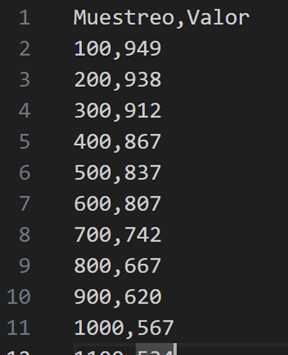
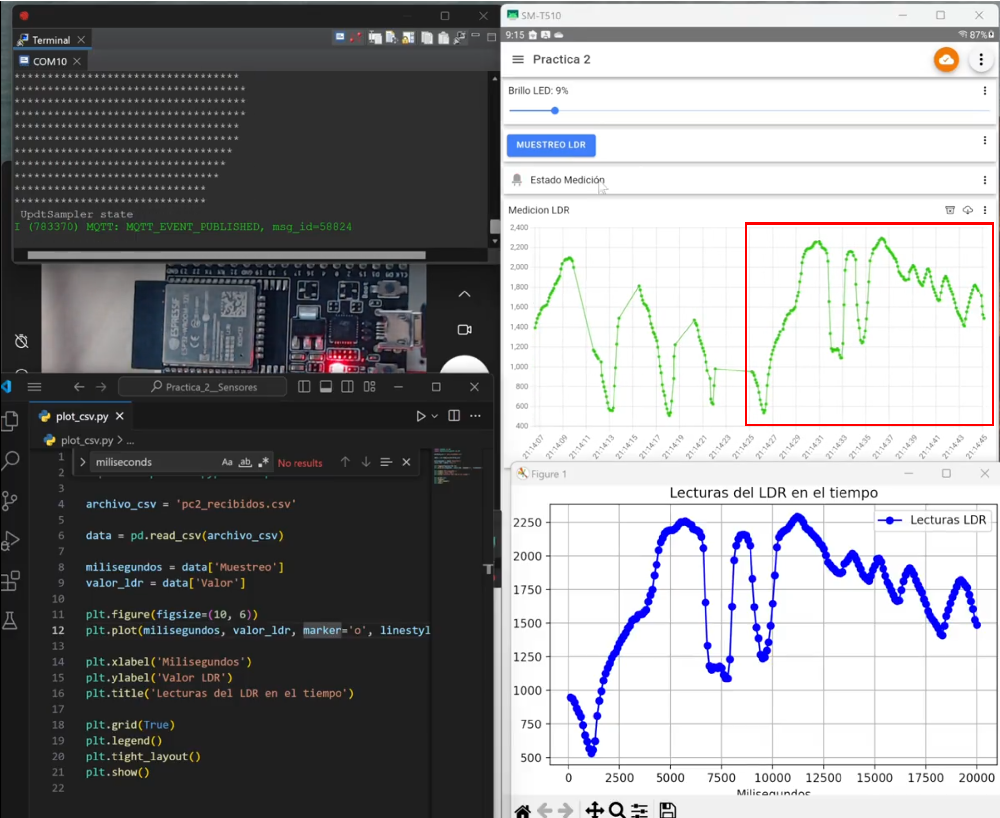
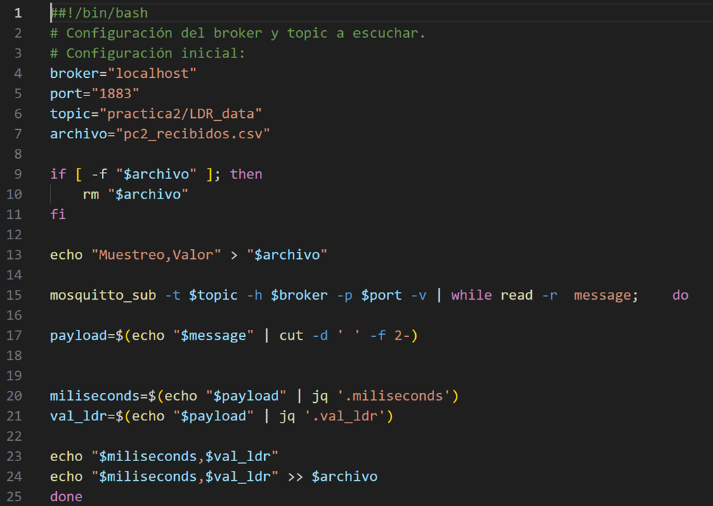
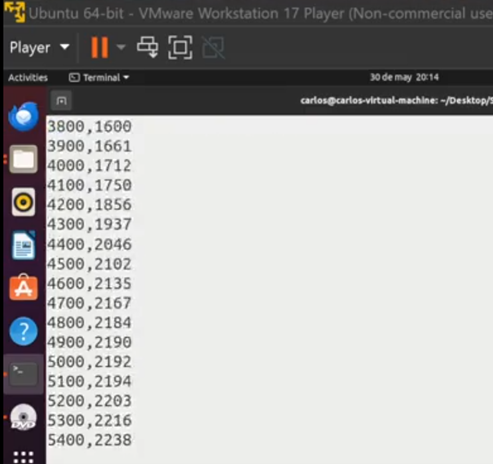

Práctica 02 - MSE Curso: Sistemas Embebidos Distribuidos
====================

Alumno: Carlos Herrera Trujillo

## Actividad 1: Lectura del sensor

Actividad de montaje de LDR y verificación de lecturas.

1. Tarjeta de conexión con GPIO34 para la lectura del LDR (en serie con resistencia de 10K) y 
GPIO25 para la emisión PWM en Led Rojo.
 

	
	

2. Configuración y uso del ADC, se utiliza el GPIO34 (ADC1_6) en el cual se hace una lectura 
periodica de 250ms (4 Hz) y, así mismo, se imprime a traves del monitor serial el valor obtenido.

	

 

## Actividad 2: Grabación y reproducción

Grabación del nivel establecido por el LDR (ADC1_6) y visualización por PWM (GPIO25), con un tiempo
de muestreo de 20ms para 1000 muestras adquiridas.

https://github.com/CarlosSHT/GitHub_MSE_SED/raw/main/Espressif_IDE/Practica_02/imgs/Actividad_02.mp4

https://github.com/CarlosSHT/GitHub_MSE_SED/assets/29582681/5803f55f-0acd-4603-8bdd-927b12173016

  <video width="600" controls>
    <source src="./imgs/Actividad_02.mp4" type="video/mp4">
    Tu navegador no soporta la etiqueta de video.
  </video>

## Entregable 3

Implementar un sistema que permita relevar el brillo sensado por el LDR en función del tiempo.
Además debe permitir controlar en tiempo real el LED externo agregado al ESP32. Utilizaremos como App de referencia IoT MQTT Panel.

- Desde la App, mediante el panel Slider, debe poder controlarse el brillo del LED conectado al nodo.

- Desde la App debe poder controlarse el inicio del muestreo del LDR con un panel de tipo Buttom. 
También debe poder finalizarse el muestreo desde el mismo panel. La tasa de muestreo del nodo debe 
ser de 10 Hz y debe poder concluir luego de 20 segundos de medición o hasta que el usuario la cancele 
desde la App (la que suceda primero).

- En la App debe agregarse un panel de tipo LED que indique si la medición está activa o no.

- En la App debe agregase un panel Line Graph que muestre en tiempo real el valor de las lecturas 
del LDR enviadas por el ESP32 (con el parámetro Max persistence en 100, aunque pueden probarse distintos valores).

- En una PC conectada a un broker (preferentemente local) debe ejecutarse un script que escuche 
un topic MQTT en el que se reciban las lecturas del LDR enviadas por el ESP32. Estos datos se 
deben ir almacenando en un archivo CSV, donde la primer columna sea el instante de la muestreo 
(en milisegundos) y la seguna columna el valor sensado por el LDR.

---
Para el uso del script bash subs_mensajePC2.sh se realizó la instalación del paquete de Ubuntu:

`sudo apt-get install jq`

Además, para asegurar de que el mensaje se publique una sola vez por parte de los controles de la 
App y del programa en el Esp32 se establece el uso de un **QoS2**
---

1.	El pulsador de la App “Muestreo LDR” realiza el inicio y finalización de la toma de muestras, 
así mismo, el LED indicador en la App señala sus dos estados de medición.

  <video width="600" controls>
    <source src="./imgs/Entregable3_Punto1.mp4" type="video/mp4">
    Tu navegador no soporta la etiqueta de video.
  </video>

2.	Control del brillo del LED Rojo en tiempo real con distintas posiciones configuradas en el Slider 
de la App, así mismo, se visualiza la intensidad mientras se realiza capturas del valor del LDR.

  <video width="600" controls>
    <source src="./imgs/Entregable3_Punto2.mp4" type="video/mp4">
    Tu navegador no soporta la etiqueta de video.
  </video>

3.	La curva obtenida en el Panel Line Graph con detención por botón y detención automática luego de 
20 segundos. En el segundo paso se utilizó el script “subs_mensajePC2.sh” para grabar los valores del 
sensor LDR recibidos.

  <video width="600" controls>
    <source src="./imgs/Entregable3_Punto3.mp4" type="video/mp4">
    Tu navegador no soporta la etiqueta de video.
  </video>

### IoT MQTT PANEL

En las siguientes imágenes se encuentran las capturas de la creación de los paneles: Brillo LED, Muestreo LDR, Estado Medición y Medición LDR. Se establece un QoS2 para los paneles de Brillo LED y Muestreo LDR.

	
	

 

	
	

### LECTURAS RECIBIDAS (SENSOR LDR)

Se realizó la publicación de datos a través de un servidor local MQTT Mosquitto, en el cual es publicado los valores obtenidos del sensor LDR a través del ADC1_6 del ESP32 con una frecuencia de muestreo de 10 Hz por 20 segundos, es decir, 200 muestras.

	

### GRAFICA PYTHON CSV

Se contrasta en la siguiente imagen que los valores recibidos y guardados en el archivo CSV tienen la misma forma que los valores recibidos en el Linegraph.

	

### SCRIPT DE MENSAJES RECIBIDOS (LINUX)

El programa realizado en el ESP32 transmite un mensaje en formato JSON, no obstante, se recibe además el nombre del topic. Por lo tanto, es necesario poder separar y obtener el payload real donde se convertirá el mensaje JSON a CSV (separado por comas).

	

 

	

CÓDIGO DEL PROYECTO (ESP IDE)

Por último, todos los archivos de la Práctica 2 se encuentran en el siguiente repositorio detallado en el README.md de la Práctica 2.

  https://github.com/CarlosSHT/GitHub_MSE_SED/tree/main/Espressif_IDE/Practica_02
  
  https://github.com/CarlosSHT/GitHub_MSE_SED/blob/main/Espressif_IDE/Practica_02/README.md

